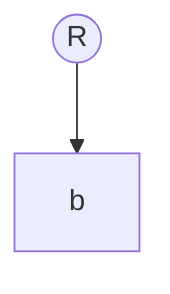
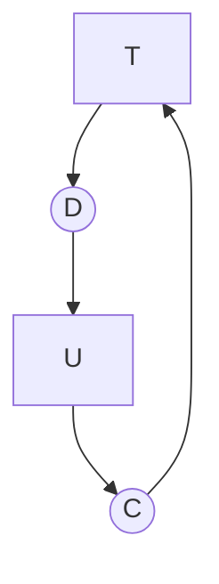

# 五. 死锁

## A. 什么是死锁

> 死锁指两个或两个以上的进程在请求资源时，请求的资源是对方无法释放的资源此时只能等待对方进程释放资源，这些进程都被阻塞的状态。

死锁的四个必备条件，当发生死锁时这四个条件同时出现：

1. 互斥条件。每个资源要么被分配，要么可用。
2. 占有和等待条件。进程可以不断的请求资源。
3. 不可抢占条件。进程已经拥有的资源只能被这个进程释放，不能被强制占用。
4. 环路等待条件。当死锁发生时，系统中会出现多个进程形成有向环路，一个进程在等待下一个进程释放的资源。

死锁的一个模型：
方形表示进程，圆形表示资源。

在模型中检查是否出现有向环图，出现则说明会出现死锁现象。
死锁图，资源分配图：

图中确实构成环路，存在死锁。

## B. 如何预防死锁

首先对存在死锁的系统分析其资源分配图。打断环路，破坏死锁条件。

1.破坏互斥条件。使用假脱机技术。

假脱机技术介绍：

假脱机：Simultaneous Peripheral Operating On-Line，同步外围操作。

脱机技术是指输入输出的数据不进入cpu等主机中进行处理，而只在外围设备中进行处理或存储至存储器中，然后主机在批量处理，一般用于低速的磁盘或低速外设的数据存取的处理。

假脱机技术是中间不经过存储设备，但需要一个缓冲区。

2.破坏占有和等待条件。在进程开始运行时，就先请求所有需要的资源，但一些进程只有运行开才知道需要什么资源

3.破坏不可抢占条件。改为抢占资源。

4.破坏环路等待条件。对进程所需的资源进行编号，进程依次按照编号进行请求。

## C. 死锁的检测

即对系统中资源，进程画出其资源分配图，然后使用深度优先搜索等判断有向图环路。

## D. 死锁的恢复

1.抢占恢复

2.回滚恢复

3.杀死进程恢复

## E. 死锁避免

安全状态：当所有进程在某一个时间突然请求其能请求的最大资源需求，此时仍然可以进行调度满足这样的需求的一种状态。

不安全状态：与安全状态相反，但不一定能引起死锁。这两者的区别是：从安全状态出发，系统能保证所有进程都能完成，但不安全状态没有这样的保证。

### 银行家算法：

迪杰斯特拉于1965年提出。

对每一个请求进行检查，检查该请求是否会到达不安全状态，如果是就拒绝。
